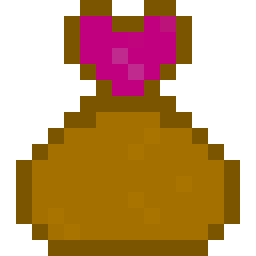
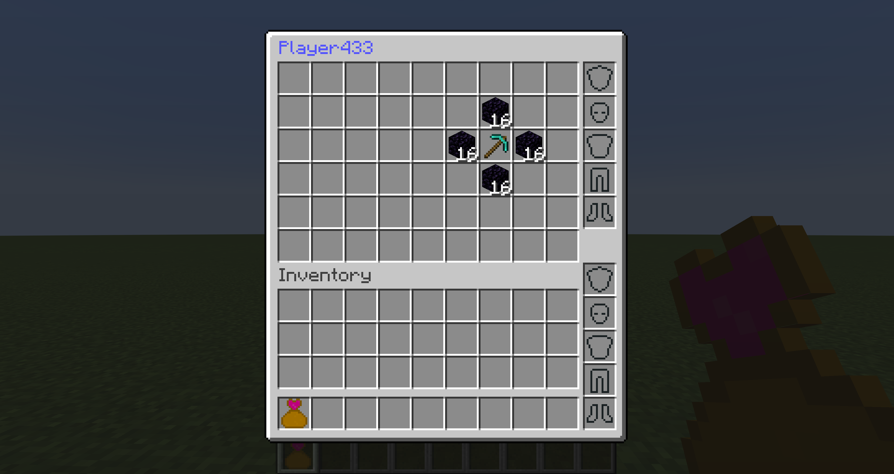
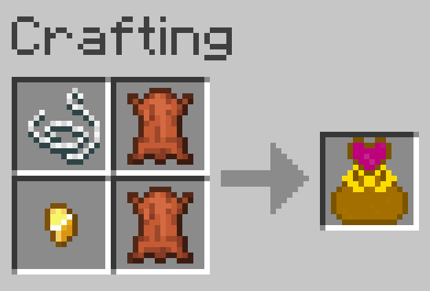

# Death Bags Revived

[Fabric API](https://github.com/FabricMC/fabric/releases) required

## About

Death Bags Revived adds a bags to the game that can be used to recover a player's inventory.
When a player dies, a Death Bag is dropped in front of them. The Death Bag is not lava proof
and can burn if the player died in lava, but there is a **Golden Death Bag** that can be crafted
to access the previous death inventory and other death inventories from the same player.

The inventory of a death bag looks like this

The items retain the same position they had in the player's inventory. If the user tries 
to take one item out by **Shift + Clicking** the item in a slot,
an attempt will be made to put it on the slot it 
was on before the player died. If the slot is occupied, it will be put on another free slot.
If no free slots are available, the item won't be taken out. The same applies to the armor
and offhand items the player had. Pressing **Shift + Click** on the Death Bag itself while 
the player is on the world, will trigger an attempt to put all inventory in the bag on the 
player's inventory. If it fails to put all the content on the player's inventory, then the 
items will remain on the bag.

If all items are taken out of a death bag, the death bag will disappear. Only 
Golden Death Bags don't disappear and allow the player to access previous death inventories.

There is a command for server admins that allow them to get the death bag of any player 
as long as they are operator level (OP) and have the name of the player they want to get 
the Death Bag from. The command is:

`/giveDeathBagItem <target>` where `<target>` is replaced by the name of the player whose 
Death Bags are desired. This Death Bag is called **Admin Death Bag**. Leaving the game will make the Admin Death Bag useless
if the admin logs in again and tries to use it. If that happens, the bag will open the 
screen inventory, but it will display `null` as the player name. 
Also, only one Admin Death Bag is usable 
at a time. For example, executing the command `/giveDeathBagItem Player326` and then 
`/giveDeathBagItem Player80` will change all existing Admin Death Bags to point to
the inventory of Player80. The Admin Death Bags look just like Golden Death Bags. In an Admin Death Bag, opening and closing the death bag 
inventory will iterate through all the death inventories of the player the bag is pointing to.

## Crafting Recipes

A **Golden Death Bag** has a shapeless crafting recipe, and it can be crafted with: 
- 1 string
- 1 golden nugget
- 2 of leather

## License

This mod uses [Fabric API](https://github.com/FabricMC/fabric) which has its own license.

This mod itself is available under The Unlicense.